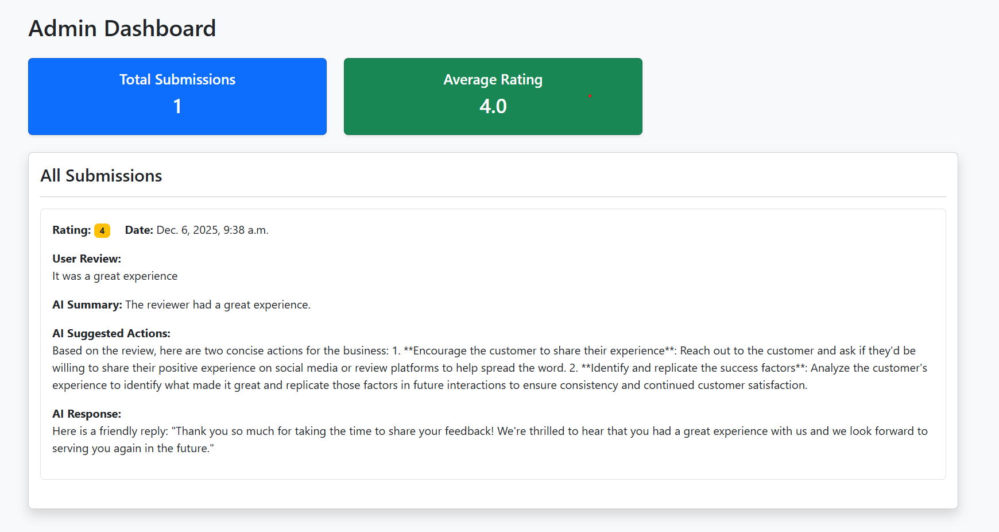

# ⭐ FYND – AI Intern Assessment  
## 🚀 Task 1 & Task 2 Combined Project

# 🌟 Task 1 — Rating Prediction via Prompting

## 🎯 Objective
Build an LLM-based classifier that predicts Yelp review ratings (1–5 stars) using prompting only.

```json
{
  "predicted_stars": 4,
  "explanation": "Brief reasoning"
}
```

## 🧠 Approach Overview
Three custom prompts were developed:
- **Prompt A — Strict JSON Instruction**
- **Prompt B — Few-Shot Examples**
- **Prompt C — Rubric-Based Rating Criteria**

Model Used: **LLaMA-3.1-70B-Instruct (OpenRouter)**

## 🧪 Steps Performed
1. Sampled 200 Yelp reviews  
2. Designed 3 prompting strategies  
3. Queried LLM for predictions  
4. Parsed JSON outputs  
5. Measured accuracy, JSON validity & consistency  
6. Generated comparison tables and charts  

## 📊 Evaluation Results

| Prompt | Accuracy | JSON Validity |
|--------|----------|---------------|
| A | 0.590 | 0.910 |
| B | 0.615 | 0.915 |
| C | 0.625 | 0.940 |

➡️ Prompt C achieves best results due to clear rubric instructions.

## 📈 Plots
Add image from notebook:

``

---

# 🛠️ Task 2 — AI-Powered Feedback System (Django Web App)

## 🎯 Objective
Build and deploy a full-stack system with:
- **User Dashboard** → Submit rating, review, get AI response  
- **Admin Dashboard** → View summaries, actions & analytics  

## 🧠 System Architecture

| Layer | Technology |
|-------|------------|
| Backend | Django + DRF |
| LLM | LLaMA-3.1-70B (OpenRouter) |
| DB | SQLite |
| Frontend | Django Templates |
| Hosting | Render |

## 🏗️ Implementation Steps
### 1️⃣ Backend & APIs
Created `Submission` model storing:
- user_rating  
- user_review  
- ai_response  
- ai_summary  
- ai_actions  

API Endpoints:
- `POST /api/submit/`
- `GET /api/submissions/`

### 2️⃣ LLM Processing
Each submission generates:
- Friendly reply  
- Summary  
- Business actions  

### 3️⃣ Dashboards
- **User:** Clean UI, AI response display  
- **Admin:** Submission list, analytics  

### 4️⃣ Deployment
- Render deployment  
- Environment variables configured  
- OpenRouter headers added  

---

# 🔗 Live Links (Insert)

**User Dashboard:**  
`https://your-link/user`  


**Admin Dashboard:**  
`https://your-link/admin_dashboard`  


---

# ✅ Features Summary

### User Dashboard
- ⭐ Star rating selector  
- 📝 Review submission  
- 🤖 AI-generated response  

### Admin Dashboard
- 📄 All submissions  
- ✂ AI summaries  
- 💡 Action suggestions  
- 📊 Analytics  

---

# 📦 Repository Structure

```
Task1/
 ├── OpenRouter.ipynb
 ├── yelp.csv
 └── task1_outputs/

Task2/
 ├── feedback/
 ├── templates/
 ├── manage.py
 └── requirements.txt
```

---

# 🎉 End of README
